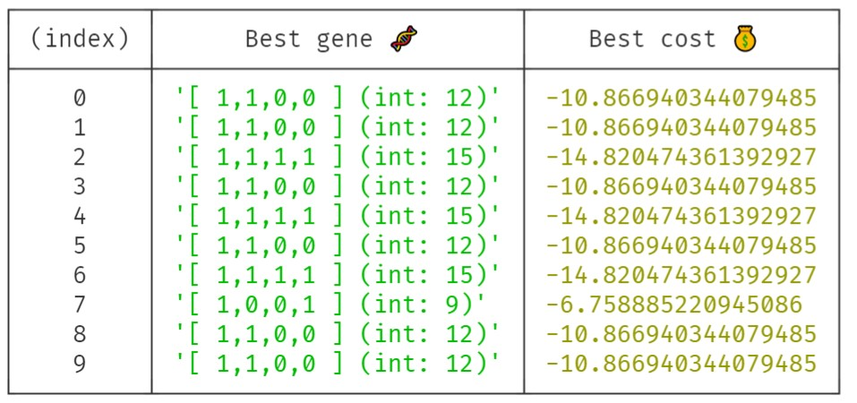

# Function approximation with evolutionary algorithms
First Ascent vs. Multi-Neighbor Ascent in Hill Climbing
Goal: show how we get stuck in local optima visually




---

# Angular project setup
This project was generated with [Angular CLI](https://github.com/angular/angular-cli) version 13.0.1.

## Development server
Run `ng serve` for a dev server. Navigate to `http://localhost:4200/`. The app will automatically reload if you change any of the source files.

## Production Build
Production build to GitHub pages:

```
ng build --prod --output-path docs --base-href /evo-function/
```
